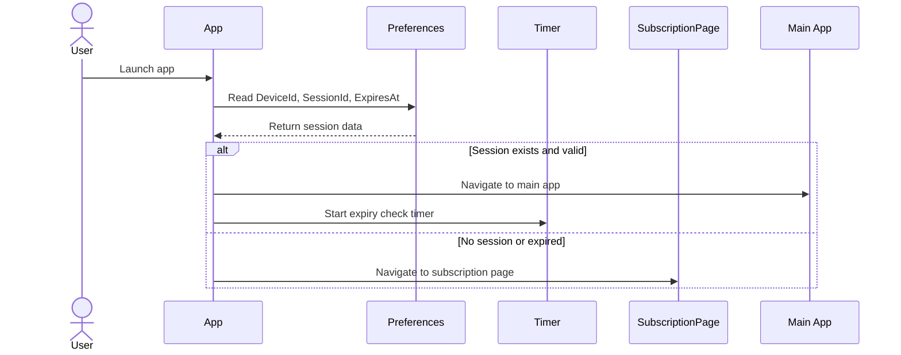
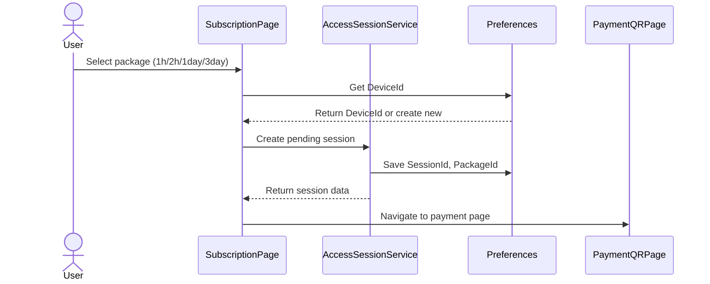
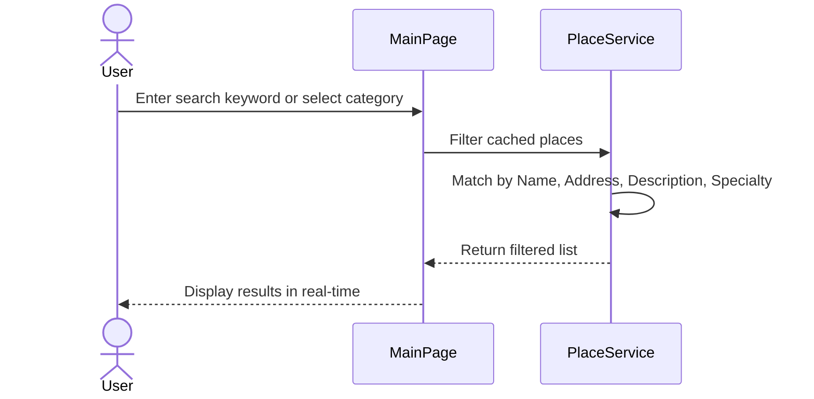
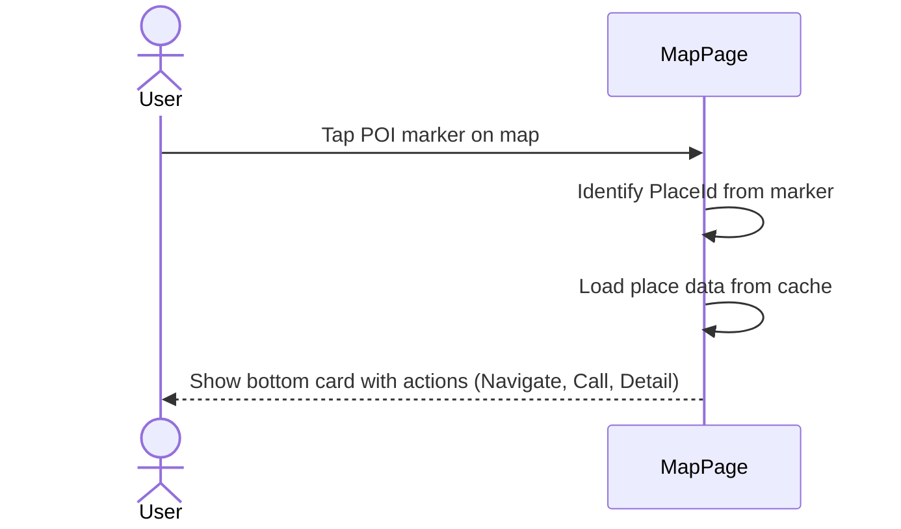
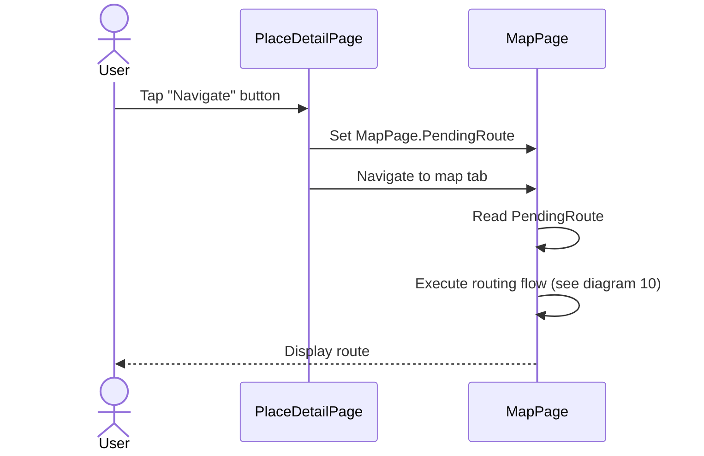

# Sequence Diagrams - TourGuideAPP

## 1. App Launch & Session Validation



## 2. Select Package & Create Pending Session



## 3. Thanh toán QR và polling kích hoạt

```mermaid
sequenceDiagram
    actor User
    paQR Payment & Polling for Activation

```mermaid
sequenceDiagram
    actor User
    participant PaymentQRPage
    participant AccessSessionService
    participant Supabase
    actor Admin
    participant Preferences
    participant MainShell as Main App

    User->>PaymentQRPage: View QR code & transfer money
    PaymentQRPage->>PaymentQRPage: Start polling every 5 seconds

    loop Check every 5 seconds
        PaymentQRPage->>AccessSessionService: Query session status
        AccessSessionService->>Supabase: GET AccessSessions
        Supabase-->>AccessSessionService: Return session data
        AccessSessionService-->>PaymentQRPage: Not activated yet
    end

    Admin->>Supabase: Call activate_session(DeviceId)
    Supabase->>Supabase: Set IsActive=true, ActivatedAt, ExpiresAt

    PaymentQRPage->>AccessSessionService: Next polling check
    AcSession Expiry Check Timer

```mermaid
sequenceDiagram
    participant Timer
    participant Preferences
    participant App
    participant SubscriptionPage
    actor User

    loop Every 60 seconds
        Timer->>Preferences: Read ExpiresAt
        Preferences-->>Timer: Return ExpiresAt timestamp
        Timer->>Timer: Compare with DateTime.UtcNow

        Timer->>App: Check if expired
        App->>App: Compare now vs ExpiresAt

        Note over App: Session valid
        App-->>Timer: Continue running
    end

    Note over Timer: When ExpiresAt reached
    App->>User: Show expiration alert
    ApLoad Places List & In-Memory Cache

```mermaid
sequenceDiagram
    participant MapPage
    participant PlaceService
    participant MemoryCache as In-memory Cache
    participant Supabase

    MapPage->>PlaceService: Request all places
    PlaceService->>MemoryCache: Check cache exists

    Note over PlaceService: First load or cache miss
    PlaceService->>Supabase: GET places WHERE IsActive=true AND IsApproved=true
    Supabase-->>PlaceService: Return places + place_images + place_tts_contents
    PlaceService->>PlaceService: Build Place objects with TTS mapping
    PlaceService->>MemoryCache: Cache in RAM
    PlaceService-->>MapPage: Return places liste Chưa có cache
        PlaceService->>Supabase: Lấy Places active/approved
        Supabase-->>PlaceService: Trả dữ liệu Places
        PlaceService->>MemoryCache: Lưu cache
        PlaceService-->>MainPage: Trả dữ liệu
    end
```

## 6. Search & Filter Places



## 7. Mở chi tiết địa điểm

```merOpen Place Detail

```mermaid
sequenceDiagram
    actor User
    participant MainPage
    participant PlaceDetailPage
    participant PlaceService

    User->>MainPage: Tap on place card
    MainPage->>PlaceDetailPage: Navigate with PlaceId
    PlaceDetailPage->>PlaceService: Get place by ID
    PlaceService->>PlaceService: Return from cache
    PlaceService-->>PlaceDetailPage: Return Place object
    PlaceDetailPage-->>User: Display gallery, info, TTS script
## 8. Display Map & POI Markers

```mermaid
sequenceDiagram
    actor User
    participant MapPage
    participant PlaceService
    participant LocationService
    participant Mapsui

    User->>MapPage: Open map tab
    MapPage->>PlaceService: Get POI list
    PlaceService-->>MapPage: Return places
    MapPage->>LocationService: Get current location
    LocationService-->>MapPage: Return GPS coordinates
    MapPage->>Mapsui: Render POI markers + user marker
    Mapsui-->>User: Display interactive map
```

## 9. Tap POI Marker & Show Bottom Card



## 10. Navigate Route from Map

```mermaid
sequenceDiagram
    actor User
    participant MapPage
    participant LocationService
    participant OSRM

    User->>MapPage: Tap "Navigate" button on card
    MapPage->>LocationService: Get current location
    LocationService-->>MapPage: Return origin coordinates
    MapPage->>OSRM: GET /route/v1/driving/{origin};{dest}?overview=full
    OSRM-->>MapPage: Return polyline geometry
    MapPage->>MapPage: Draw route line on map layer "Route"
    MapPage->>MapPage: Draw destination marker
    MapPage->>MapPage: Zoom to route bounds
    MapPage-->>User: Display route and cancel panel
```

## 11. Navigate Route from PlaceDetailPage



## 12. Phát thuyết minh thủ công

```mermaid
sequencManual Narration Playback

```mermaid
sequenceDiagram
    actor User
    participant PlaceDetailPage
    participant NarrationService
    participant TextToSpeech

    User->>PlaceDetailPage: Tap "Narrate" button
    PlaceDetailPage->>NarrationService: Call SpeakAsync(tts_script, tts_locale)
    NarrationService->>TextToSpeech: Play audio with locale
    TextToSpeech-->>User: Play narration sound

```mermaid
sequencReal-Time GPS & Automatic Geofence Narration

```mermaid
sequenceDiagram
    participant OS as Operating System
    participant LocationService
    participant GeofenceEngine
    participant MapPage
    participant NarrationService
    participant UserProfileService
    actor User

    OS->>LocationService: Deliver new GPS location
    LocationService->>MapPage: Raise LocationChanged event + update marker
    LocationService->>GeofenceEngine: Send current coordinates
    
    GeofenceEngine->>GeofenceEngine: Filter: places with TTS script
    GeofenceEngine->>GeofenceEngine: Filter: within radius (default 50m)
    GeofenceEngine->>GeofenceEngine: Filter: passed cooldown (LastPlayedAt)
    GeofenceEngine->>GeofenceEngine: Sort by Priority DESC, Distance ASC
    GeofenceEngine->>GeofenceEngine: Debounce 2 seconds
    
    Note over GeofenceEngine: Has matching POI
    GeoPrevent Duplicate POI Narration (Cooldown Logic)

```mermaid
sequenceDiagram
    participant GeofenceEngine
    participant MapPage
    participant NarrationService

    GeofenceEngine->>GeofenceEngine: Check _lastSpokenPlaceId vs nearest POI

    Note over GeofenceEngine: Same POI just spoke
    GeofenceEngine->>MapPage: Return null - skip narration
    
    Note over GeofenceEngine: Different POI found
    GeofenceEngine->>MapPage: Return new POI
    MapPage->>MapPage: Set _lastSpokenPlaceId
    MapPage->>MapPage: Set _lastSpokenPlace reference
    MapPage->>NarrationService: SpeakAsync(place)
    MapPage->>MapPage: Update LastPlayedAt on place object
    R Code Scan & Place Detail

```mermaid
sequenceDiagram
    actor User
    participant QRScanPage
    participant Camera
    participant ZXing
    participant PlaceDetailPage

    User->>QRScanPage: Open QR scan page
    QRScanPage->>Camera: Request camera permission
    Camera-->>QRScanPage: Camera ready
    User->>Camera: Point QR code at camera
    Camera->>ZXing: Process frame image
    ZXing-->>QRScanPage: Return QR content (numeric PlaceId)
    
    Note over QRScanPage: Parse numeric ID
    QRScanPage->>PlaceDetailPage: Navigate with PlaceId
    PlaceDetailPage->>PlaceDetailPage: Load place from cache
    PlaceDetailPage-->>User: Display place detaileDiagram
    actor User
    participant QRScanPage
    participant Camera
    parView Tours & Tour Stops

```mermaid
sequenceDiagram
    actor User
    participant ToursPage
    participant TourDetailPage
    participant PlaceService

    User->>ToursPage: Open tours page
    ToursPage->>PlaceService: Get cached places
    PlaceService-->>ToursPage: Return active & approved places
    ToursPage->>ToursPage: Generate tour recommendations (quick/balanced/full)
    ToursPage-->>User: Display tour cards with filters
    
    User->>ToursPage: Select a tour
    ToursPage->>TourDetailPage: Navigate with tour data
    TourDetailPage-->>User: Display tour stops with details
    
    User->>TourDetailPage: Tap on a stop
    TourDetailPage->>ToursPage: Navigate to navigate flow
## 16. Xem tour và mở điểm dừng

```mermaid
sequenceDiagram
    actor User
    participaActivate Session on Supabase

```mermaid
sequenceDiagram
    actor Admin
    participant BankTransfer as Bank Transfer Confirmation
    participant Supabase
    participant AccessSessions

    Admin->>BankTransfer: Verify transfer content (DeviceId + amount)
    BankTransfer-->>Admin: Confirmed
    Admin->>Supabase: Execute activate_session(DeviceId) function
    Supabase->>AccessSessions: Query pending session by DeviceId
    Supabase->>AccessSessions: Update IsActive=true, ActivatedAt=now, ExpiresAt=now+duration
    Supabase-->>Admin: Activation complete
```mermaid
sequenceDiagram
    actor Admin
    parNetwork Loss Handling

```mermaid
sequenceDiagram
    actor User
    participant App
    participant PlaceService
    participant Supabase
    participant OSRM

    Note over User,App: Network connection lost

    User->>App: Perform action (open places, navigate)
    
    Note over App: Access cached places
    App->>PlaceService: Request places
    PlaceService->>PlaceService: Return from in-memory cache
    PlaceService-->>App: Success with cached data
    
    Note over App: Route calculation fails
    App->>OSRM: Request route
    OSRM--xApp: Connection timeout
    App-->>User: Show error message, no
    alt Gọi Places
        App->>PlaceService: Yêu cầu dữ liệu
        PlaceService->>Supabase: Request
        Supabase--xPlaceService: Timeout / network error
        PlaceService-->>App: Trả lỗi có kiểm soát hoặc cache cũ
    elsLocation Permission Denied

```mermaid
sequenceDiagram
    actor User
    participant App
    participant OS as Operating System

    App->>OS: Request location permission
    User->>OS: Deny permission
    OS-->>App: Permission denied response
    App-->>User: Show explanation and guide to
```mermaid
sequenceDiagram
    actor User
    participant App
    participant OS as Hệ điều hành

    App->>OS: Yêu cầu quyền vị trí
    User->>OS: Từ chối quyền
    OS-->>App: Permission denied
    App-->>User: Hiển thị giải thích và hướng dẫn mở Settings
```

## Gợi ý dùng cho báo cáo
---

## Key Diagrams for Reports

If your report needs to be concise, select these 8 core diagrams:
1. App Launch & Session Validation
2. QR Payment & Polling for Activation
3. Load Places List & In-Memory Cache
4. Display Map & POI Markers
5. Navigate Route from Map
6. Real-Time GPS & Automatic Geofence Narration
7. QR Code Scan & Place Detail
8. Admin Activate Session on Supabase

**Notes:**
- Removed `select` statements to ensure clean sequence flow
- All interactions follow actual project architecture
- Cache management aligned with CLAUDE.md specifications
- GPS/Geofence logic includes cooldown and debounce behavior
- No database select logic in UI flows (simplified to business operations)